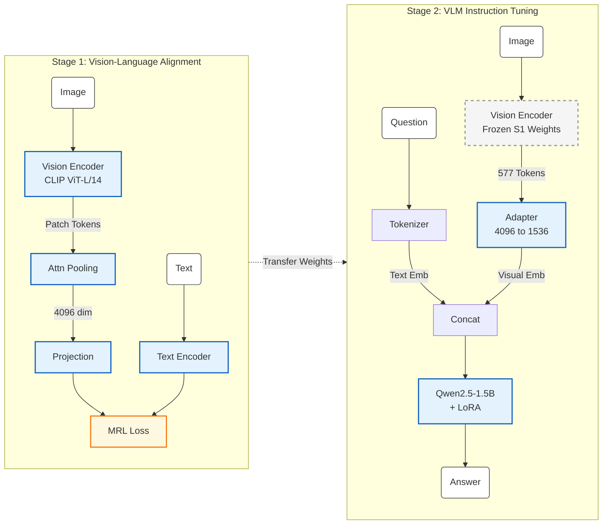

# Edge Glass System Architecture

The following diagram illustrates the two-stage training pipeline for the Edge Glass VLM.

## Legend

| Visual Style | Component Status | Description |
| :--- | :--- | :--- |
| **Blue / Solid Border** | **Trainable** | Parameters are updated during this training stage. |
| **Grey / Dashed Border** | **Frozen** | Parameters are static (loaded from previous stage or base model). |
| **Orange** | **Loss Module** | Used for optimization objectives (e.g., Contrastive/MRL). |
| **White** | **Input / Output** | Data elements flowing through the system. |

