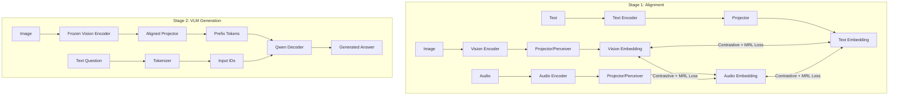

# System Architecture Report

## 1. High-Level Architecture Overview

The **Edge Glass Modular** project is a multi-modal AI system designed to align vision, text, and audio representations and subsequently leverage these aligned features for generation tasks (Visual Question Answering, Captioning). The architecture follows a two-stage paradigm:

1.  **Stage 1: Multimodal Alignment**:
    *   Independent encoders for Vision, Text, and Audio process raw inputs into high-dimensional embeddings.
    *   A **Multimodal Alignment Model** projects these embeddings into a shared latent space.
    *   Training utilizes **Contrastive pre-training (CLIP-style)** and **Matryoshka Representation Learning (MRL)** to enforce alignment at multiple granularities (dimensions), enabling flexible inference efficiency.
    *   Architecture variants include simple MLP projection, Attention Pooling, or **Perceiver Resampler** for compressing temporal/spatial features.

2.  **Stage 2: Vision-Language Generation (VLM)**:
    *   The aligned Vision Encoder from Stage 1 is frozen and used as a feature extractor.
    *   A **Decoder (LLM)**, specifically **Qwen (2.5-3B/7B)**, is conditioned on these visual features (injected as prefix embeddings) to generate text responses.
    *   An experimental **Tiny Recursive Model (TRM)** decoder is also available, exploring recursive reasoning on latent states.

### high-Level Data Flow Diagram

---

## 2. Core Components and Modules

### 2.1 Encoders (`src/encoders/`)

The system supports modular encoders that can be frozen or fine-tuned.

*   **Vision Encoder (`vision.py`)**
    *   **Base**: `CLIPVisionModel` (e.g., `openai/clip-vit-large-patch14-336`). Typically frozen.
    *   **Processing**:
        1.  **Extract**: Outputs localized patch features (sequence) and CLS token.
        2.  **Project**: Maps hidden dimension (e.g., 1024) to target dimension (e.g., 4096 or 512).
        3.  **Refine (Optional)**:
            *   **Perceiver Resampler**: Compresses variable patch sequences ($N \times D$) into fixed latents ($K \times D$) using cross-attention with learnable queries.
            *   **Attention Pooling**: Learnable weighted pooling of patch features (if Perceiver is disabled).
        4.  **Matryoshka (MRL)**: Slices the output embedding at defined indices (e.g., 128, 256, 512) to create nested representations.
    *   **Output**: `VisionEncoderOutput` containing `pooled` (vector), `sequence` (tensor), and `mrl_embeddings` (dict).

*   **Text Encoder (`text.py`)**
    *   **Base**: `SentenceTransformer` (e.g., `all-MiniLM-L6-v2`) or `CLIPTextModel`. Frozen by default.
    *   **Processing**: Projects encoded sentence embeddings to the shared dimension.
    *   **MRL**: Supports Matryoshka slicing on the pooled text embedding.
    *   **Output**: `TextEncoderOutput`.

*   **Audio Encoder (`audio.py`)**
    *   **Base**: `WhisperModel` (e.g., `openai/whisper-large-v3`). Frozen.
    *   **Processing**: Uses `PerceiverResampler` to handle variable-length audio spectrograms, compressing them into fixed latent tokens alongside standard pooling.

### 2.2 Alignment Model (`src/models/alignment.py`)

*   **Class**: `MultimodalAlignmentModel`
*   **Role**: The central orchestrator for Stage 1. It instantiates the specific Encoders based on config.
*   **Function**:
    *   Accepts `images`, `texts`, `audio_features`.
    *   Forward passes through respective encoders.
    *   **Fusion (Optional)**: Can fuse modalities using `MultimodalFusion` (concat/cross-attn/gated) before calculating loss, though mostly used for bi-modal alignment in current configs.
    *   **Loss Computation**: Calculates the `AlignmentLoss` (Contrastive + MRL) or `TriModalAlignmentLoss`.

### 2.3 Decoders (`src/decoders/`)

*   **Qwen Decoder (`qwen.py`)**
    *   **Class**: `QwenDecoder`
    *   **Base**: HuggingFace `AutoModelForCausalLM` (e.g., `Qwen/Qwen2.5-7B-Instruct`).
    *   **Features**:
        *   **LoRA**: Integrated efficient fine-tuning via `peft`.
        *   **Quantization**: Supports 4-bit/8-bit loading (`BitsAndBytesConfig`).
        *   **Prefix Injection**: Custom `forward` and `generate` methods specifically handle `prefix_embeds` (visual tokens) by concatenating them before text embeddings.

*   **TRM Decoder (`trm.py`)**
    *   **Class**: `TRMDecoder`
    *   **Design**: A custom "Tiny Recursive Model" built from scratch.
    *   **Components**: RoPE embeddings, RMSNorm, GLU variants.
    *   **Purpose**: Experimental efficient decoding with recursive depth.

### 2.4 VLM Wrapper (`src/models/trm_qwen_vlm.py`)

*   **Class**: `QwenVLM`
*   **Role**: The orchestrator for Stage 2 (Visual Question Answering).
*   **Composition**:
    *   `qwen_decoder`: The Generation LLM.
    *   `vision_proj`: A linear layer projecting aligned vision tokens to the LLM's hidden dimension.
    *   **TRM Recursion (Optional)**: Implements a recursive loop (`down_proj` -> `TRMLayer` x N -> `up_proj`) on the LLM's hidden states to refine representations ("thinking" steps) before final logit prediction.

---

## 3. Interfaces and Data Flow

### 3.1 Interface Specifications

| Component | Input | Output Details |
| :--- | :--- | :--- |
| **VisionEncoder** | `images` (B, 3, H, W) | `pooled` (B, D), `sequence` (B, L, D), `mrl_embeddings` Dict[int, Tensor] |
| **Perceiver** | `x` (B, Seq, Dim) | `latents` (B, NumLatents, Dim) |
| **MRL Projection** | `x` (B, Dim) | Dict {dim: normalized_slice(B, dim)} |
| **AlignmentModel** | `images`, `texts`, `audio` | `AlignmentModelOutput` (loss, emb dict, logits) |
| **QwenVLM** | `vision_tokens`, `input_ids` | `CausalLMOutputWithPast` (loss, logits, hidden_states) |

### 3.2 Data Flow: Alignment Training
1.  **Batch Loading**: Pairs of (Image, Text) are loaded.
2.  **Forward Pass**:
    *   Image $\to$ VisionEnc $\to$ Proj $\to$ MRL $\to$ `emb_v_dict`
    *   Text $\to$ TextEnc $\to$ Proj $\to$ MRL $\to$ `emb_t_dict`
3.  **Loss Calculation**:
    *   **Contrastive**: InfoNCE on full-dimension embeddings.
    *   **MRL**: InfoNCE on sliced embeddings (e.g., first 128, 256 dims).
    *   Weighted sum: $L_{total} = w_{clip} \cdot L_{clip} + w_{mrl} \cdot \sum L_{mrl}^{(d)}$

### 3.3 Data Flow: VLM Training
1.  **Batch Loading**: (Image, Question, Answer).
2.  **Prefix Generation**:
    *   Image $\to$ **Frozen** Aligned VisionEnc $\to$ `vision_tokens`.
    *   `vision_tokens` $\to$ `vision_proj` $\to$ `prefix_embeds` (mapped to Qwen hidden dim).
3.  **Context Construction**:
    *   Concat `[prefix_embeds, question_embeds, answer_embeds]`.
4.  **Causal Masking**: Standard autoregressive mask over the sequence.
5.  **Forward Pass**: Qwen processes sequence.
6.  **Recursive Refinement (Optional)**:
    *   Qwen Last Hidden State $\to$ TRM Recursive Loop $\to$ Refined State.
7.  **Loss**: Cross-Entropy on `answer` tokens only (labels for prefix/question are -100).

---

## 4. Design Assumptions & multimodality

1.  **Frozen Strong Backbones**: The system assumes pre-trained uni-modal encoders (CLIP, Whisper, SentenceBERT) are sufficiently strong feature extractors and do not require fine-tuning. Only projectors/adapters are trained.
2.  **Alignment via Projection**: Alignment is achieved purely by mapping distinct modalities into a shared geometric space via MLP or Perceiver adapters.
3.  **Modularity**: Encoders are hot-swappable via configuration. The `VisionEncoder` class internally handles the switch between standard CLIP logic and Perceiver logic based on the config flags.
4.  **Variable Inference Cost (MRL)**: The design explicitly assumes that downstream tasks might require different trade-offs between accuracy and dimensionality. MRL allows the same model to serve 128-dim embeddings (fast retrieval) or 4096-dim embeddings (high precision) without retraining.
5.  **Latent Visual Summarization**: The use of Perceiver Resampler assumes that semantic visual information can be compressed into a small, fixed number of latent queries (e.g., 64 tokens) rather than using the full grid of patches (e.g., 256+ tokens), crucial for efficient LLM prefixing.
